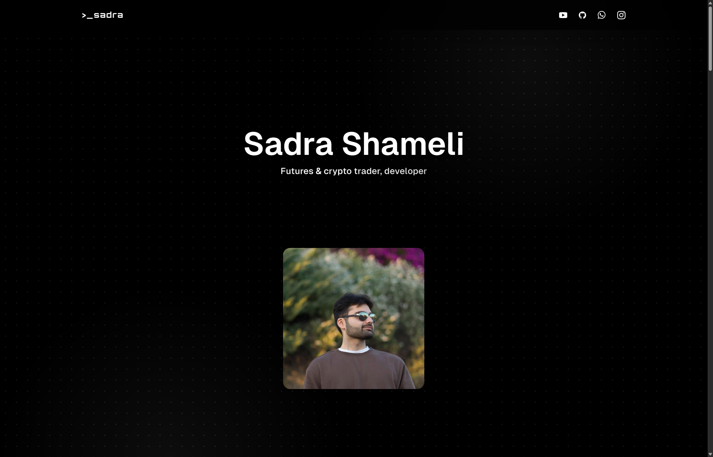

## sadra.nl

This project is part of a full-stack application with multiple objectives, serving as both a personal portfolio and a backend for Sensor Hub devices. The application makes the devices able to fetch configuration, register telemetries and save noise recordings. Additionally, it includes a frontend for visualizing the data collected by the Sensor Hub devices. Key responsibilities:

 

 

### Features

- Type-safe front-end and back-end using Typescript, React, Next.js and tRPC
- Utilizing React Query for efficient state management, handling loading and error states, and seamlessly managing stale data
- Integrating Tailwind CSS with Framer Motion for a rapid, responsive and fluid UI, ensuring a modern and consistent design language across the application and enhancing the user experience
- Using drizzle for near-instant SQL queries and mutations, enhancing the application's responsiveness",
- Implemented CRUD functionalities using Next.js App Router to manage the database and user interactions effectively
- Enhanced application performance with efficient lazy loading and advanced routing techniques to eliminate unused code
- Designed and implemented reusable react components, contributing to code modularity and maintainability
- Incorporating a CI/CD pipeline using GitHub Actions for streamlined and automated deployments, resulting in faster and more reliable code base
- Improving the quality of the received .wav noise recording samples by applying DC filtering, A/C weighting and normalizing the samples for better hearing
- Implemented SEO best practices to improve the search engine ranking of the portfolio, enhancing visibility and accessibility, and achieving excellent Core Web Vitals metrics

---

Disclaimer: Please note that this project is currently under development. Various tests are conducted to make it bug-free, but there is always the possibility of errors.

Created with ♥ and maintained by Sadra Shameli. All Rights Reserved.
